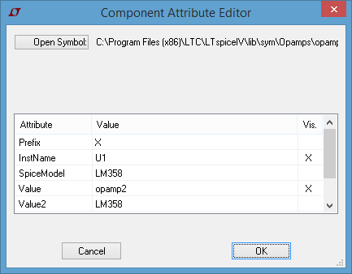
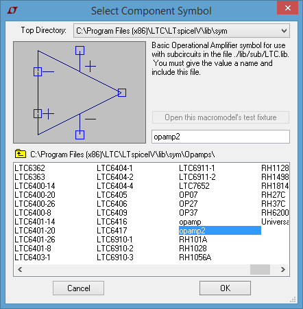

==============================
Cutsom Operational Amplifiers
==============================

------------------
Symbol Parameters
------------------

  * :code:`SpiceModel` <-- Where to search for the Model
  * :code:`Value` <-- Schematic Symbol Descriptive Name
  * :code:`Value2` <-- Model Identifier

------------------------------
Include directly on the sheet
------------------------------

Recommended for one time use

  - Search online for the model/subckt definition
    + Pins need to have the following order, defintion
      * 1 : Non-Inverting Input
      * 2 : Inverting Input
      * 3 : Positive Power Supply
      * 4 : Negative Power Supply
      * 5 : Output
  - From the Edit menu or the toolbar icon select the |SpiceDirective|
  - Option A: write/copy the **.subckt** definition Spice Directive and place it on the sheet somewhere.
  - Option B: write :code:`.include *filename.txt*` in the directive *(filename.txt contains the subckt definition)*
    + *filename.txt* should reside in the same directory as the spice **.asc** file
  - From the Edit menu or the toolbar icon select the |IconComponent|
  - Search for the component symbol "***opamp2***" |SelOpAmp2Sym|
  - Place on the sheet and **Right Click** on the symbol to edit the attributes |DlgOpAmp2Attr|
    + **SpiceModel** : <Name of the Subckt> e.g. LM358 if :code:`.SUBCKT LM358 1 2 3 4 5`
    + **Value** : <Whatever you want to call it>
    + **Value2** : <Name of the Subckt>

.. |IconComponent| image:: img/iconComponent.png

--------------------------------
Include in the *Static* Library
--------------------------------

Recommended if you plan on using this component often across multiple projects

  - Search online for the model/subckt definition
    + Save the file in the :code:`...\lib\sub\` directoy of LTSpice e.g. :code:`*myOpA.mod*`
  - Create a copy the file :code:`...\lib\sym\Opamps\opamp2.asy` and rename e.g. :code:`*myOpA.asy*`
  - Open the newly created *.asy* file for editing with any text editor
    + change the *<descName>* in the line :code:`SYMATTR Value *<descName>*` to a name you would like to identify your OpAmp
    + change the *<SpiceModelFileName>* in the line :code:`SYMATTR SpiceModel *<SpiceModelFileName>*` to the model definition filename  e.g. :code:`*myOpA.mod*`
    + change the *<SubcktName>* in the line :code:`SYMATTR Value2 *<SubcktName>*` to the name of the Subckt e.g. LM358 if :code:`.SUBCKT LM358 1 2 3 4 5`
    + change the *<...>* in the line :code:`SYMATTR Description *<...>*` to whatever description you would like to give the component
  - You will notice the lines :code:`PINATTR SpiceOrder 1` and  :code:`PINATTR PinName In+`
    + These numbers should correspond to the definition within your *.subckt* for the symbol diagram to be coherent
  - Restart LTSpice and you should be able to search for your new custom Operational Amplifier

