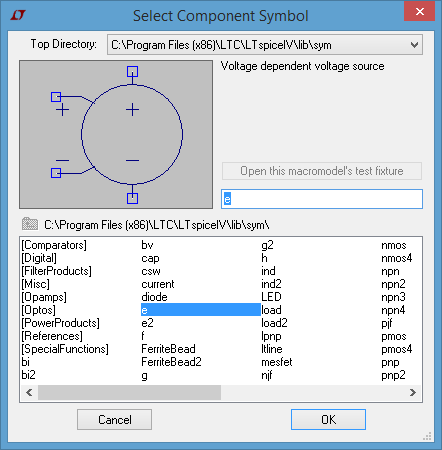

============================
Ideal Operational Amplifier
============================

An ideal Operational amplifier has the following characteristics:

  * Infinite voltage gain
  * Infinite input impedance
  * Zero output impedance
  * Infinite bandwidth
  * Zero input offset voltage (i.e., exactly zero out if zero in).

These characteristics can be modeled in Spice by a Voltage dependent Voltage source

  - Syntax: :code:`Exxx n+ n- nc+ nc- <gain>`

    + where *<gain>* would ideally be infinite but 1E9 is around the upper limit of most OpAmps

---------------------
Real vs Ideal Op-Amp
---------------------

+---------------------------+---------+----------------+
| Parameter                 | Ideal   |  Typical Real  |
+===========================+=========+================+
| Differential voltage gain |  ∞      |  1E5 - 1E9     |
+---------------------------+---------+----------------+
| Common mode voltage gain  |  0      |   1E-5         |
+---------------------------+---------+----------------+
| Gain bandwidth product f  |  ∞      | 1 MHz - 1 GHz  |
+---------------------------+---------+----------------+
| Input resistance R        |   ∞     | 1E6 -- 1E12 Ω  |
+---------------------------+---------+----------------+
| Output resistance R       |   0     | 50 - 1000 Ω    |
+---------------------------+---------+----------------+

---------------------------------
Voltage Dependent Voltage Source
---------------------------------

  - From the Edit menu or the toolbar icon select the |IconComponent|
  - Search for the component symbol "**e**" or "**e2**" |SelCompVCVS|
  - Place on the sheet and **Right Click** on the symbol to edit the attributes |DlgVCVSAttr|

    + **Value** : set to the desired *<gain>* e.g. **1E9**

