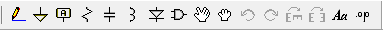

===================================
Cutsom Schematic Component Symbols
===================================

When you search online for a Spice model of a specific component you normally get a subcircuit definition of the device.

:code:`.SUBCKT LM723 2 3 4 5 6 7 9 10 11 12 13`

This specific device may be a 
  - transistor
  - inductor, capacitor, resistor, diode, ...
  - integrated circuit, current regulator, operational amplifier,...
  - ...

Whatever it be, if it is defined as a *subcircuit* model you will *not* be able to use the standard device symbols listed in the schemtaic toolbar of LTSpice |schematicToolbar|

The existing components defined in the Component section will most probably not match up with the subcircuit definition, so safest way is to draw up our own symbol.

First step is to find online the *sub*-circuit definition of the device you would like to simulate and save this file in either the LTSpice subcircuit directory [#ltsubcktdir]_ *or* your own directory.

The next steps depend on how much time you are willing to invest in this symbol. The options are presented from easiest to hardest, also from worst to best looking.

---------------------
Auto-generated Block
---------------------

  - Start LTSpice and open the subcircuit definition file.
  - Highlight the name of the device are right-click to open the context menu and select *Create Symbol* |subckt_MenuCreateSymbol|
    
    + a Dialog will pop up identifying the name and number of nodes to map onto the symbol. 

    |subckt_SymCreateConfirmDlg|

  - Now you will have generated a new **ugly** symbol which is saved in a subdirectory called Auto Generated in the LTSpice symbols directory [#ltsymdir]_.

.. image:: img/subckt_SymbolAutoGenerated.png

  This symbol can be tweaked and saved and used right after *restarting LTSpice*.

.. |subckt_SymCreateConfirmDlg| image::img/subckt_SymbolAutoGenerateDlg.png

.. [#ltsubcktdir] Windows : C:\Program Files (x86)\LTC\LTspiceIV\lib\sub
.. [#ltsymdir] Windows : C:\Program Files (x86)\LTC\LTspiceIV\lib\sym

--------------------------------
Copy and modify existing symbol
--------------------------------

--------------------------------
Include in the *Static* Library
--------------------------------

Recommended if you plan on using this component often across multiple projects

  - Search online for the model/subckt definition

    + Save the file in the :code:`...\lib\sub\` directoy of LTSpice e.g. :code:`myOpA.mod`
  - Create a copy the file :code:`...\lib\sym\Opamps\opamp2.asy` and rename e.g. :code:`myOpA.asy`
  - Open the newly created *.asy* file for editing with any text editor

    + change the *<descName>* in the line :code:`SYMATTR Value <descName>` to a name you would like to identify your OpAmp
    + change the *<SpiceModelFileName>* in the line :code:`SYMATTR SpiceModel <SpiceModelFileName>` to the model definition filename  e.g. :code:`myOpA.mod`
    + change the *<SubcktName>* in the line :code:`SYMATTR Value2 <SubcktName>` to the name of the Subckt e.g. LM358 if :code:`.SUBCKT LM358 1 2 3 4 5`
    + change the *<...>* in the line :code:`SYMATTR Description <...>` to whatever description you would like to give the component
  - You will notice the lines :code:`PINATTR SpiceOrder 1` and  :code:`PINATTR PinName In+`
  
    + These numbers should correspond to the definition within your *.subckt* for the symbol diagram to be coherent
    + Note that :code:`SpiceOrder` refers to the order in which the pins are defined in the subckt (left to right) not the actual numbers of letters

      * The PinName which describes the coherence between schematic and pin is what is important

e.g. SpiceModel File : *MyOpA.mod*

::

  * Connections:        +input
  *                       |  -input
  *                       |    | +Vsupply
  *                       |    |    | -Vsupply
  *                       |    |    |    |  output
  *                       |    |    |    |    |
  .subckt myopa123         3    2    7    4    6

e.g. Spice Schematic: *MyOpA.asy*

:: 

  PIN -32 48 NONE 0
  PINATTR PinName In-
  PINATTR SpiceOrder 2
  PIN -32 80 NONE 0
  PINATTR PinName In+
  PINATTR SpiceOrder 1
  PIN 0 96 NONE 0
  PINATTR PinName V-
  PINATTR SpiceOrder 4
  PIN 32 64 NONE 0
  PINATTR PinName OUT
  PINATTR SpiceOrder 5
  PIN 0 32 NONE 0
  PINATTR PinName V+
  PINATTR SpiceOrder 3

  - Restart LTSpice and you should be able to search for your new custom Operational Amplifier

