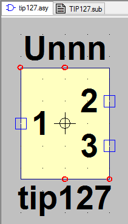

===================================
Cutsom Schematic Component Symbols
===================================

When you search online for a Spice model of a specific component you normally get a subcircuit definition of the device.

:code:`.SUBCKT LM723 2 3 4 5 6 7 9 10 11 12 13`

This specific device may be a 
  - transistor
  - inductor, capacitor, resistor, diode, ...
  - integrated circuit, current regulator, operational amplifier,...
  - ...

Whatever it be, if it is defined as a *subcircuit* model you will *not* be able to use the standard device symbols listed in the schemtaic toolbar of LTSpice |schematicToolbar|

The existing components defined in the Component section will most probably not match up with the subcircuit definition, so safest way is to draw up our own symbol.

.. |schematicToolbar| image:: img/schematicToolbar.png

First step is to find online the **sub**-circuit definition of the device you would like to simulate and save this file in either the LTSpice subcircuit directory [#ltsubcktdir]_ *or* your own directory.

The next steps depend on how much time you are willing to invest in this symbol. The options are presented from easiest to hardest, also from worst to best looking.

---------------------
Auto-generated Block
---------------------

  - Start LTSpice and open the subcircuit definition file.
  - Highlight the name of the device are right-click to open the context menu and select **Create Symbol** |subckt_MenuCreateSymbol|
    
    + a Dialog will pop up identifying the name and number of nodes to map onto the symbol |subckt_SymCreateDlg|

  - Now you will have generated a new *ugly* symbol which is saved in a subdirectory called Auto Generated in the LTSpice symbols directory [#ltsymdir]_. |subckt_AutoGenSyn|
  - This symbol can be tweaked and saved and used right after **restarting LTSpice**.

    + Note that the pins are represented as in the subcircuit, to make sense of them you may want to change the display name from a number to a meaningfull word, unless these correspond to the device pin numbers and you are fine with that.

.. |subckt_SymCreateDlg| image:: img/subckt_SymbolAutoGenerateDlg.png
.. |subckt_MenuCreateSymbol| image:: img/subckt_SymbolAutoGenerateMenu.png

--------------------------------
Copy and modify existing symbol
--------------------------------

  - Navigate to the LTSpice symbols directory [#ltsymdir]_ , copy and rename the file to the name of your new device.
  - Open the newly saved symobl file in LTSpice and tweak it with the symbol editor to your liking.

Link Subcircuit NetList to Symbol Pins
----------------------------------------

  - Open the subcircuit definition file, note the Netlist and understand which pin is represented by which node. |subcktFile|

    + in this file the nodes **1 2 3** form the netlist and are described as a comment below as corresponding to **Collector, Base** and **emitter** respectively.
    + IMPORTANT: **The actual node numbers do not matter, the order in which they are defined is important**.
    + In this example subcircuit definition the node numbers and the order happen to coincide, but in another case they may not.

  - Back in the symbol drawing file check the Netlist order of the defined Pins/Ports : *Menu:* **View --> Pin Table** |dlgNetList|

    + The number of pins must correspond to the number of nodes 
    + The pins Name and **SpiceOrder** should correspond to the Node sequence defined in the subcircuit file. **The sequence of numbers, Not the alpha/numeric value of the nodes themselves**

      * :code:`.SUBCKT TIP121 10 5 7 ` <-- has a spice order 1 --> node 10, 2 --> node 5, 3 --> node 7
      * a subcircuit definition may have several nodes, only the exposed nodes are defined in the subcircuit definition line

  - If you want to modify a pin/Port Name/Label or Netlist Order, right click on one of the defined pins on the symbol editor sheet and that specific Pins Properties will pop up. |dlgPinPortProp|

Link Symbol to Subcircuit Model File
-------------------------------------

  - With the symbol schematic file open and active in LTSpice open the Attributes window. */Cntrl+A/*

    + *Menu:* **Edit --> Attributes --> Edit Attributes** |dlgSymbolAttributeEditor|

+------------+---------+---------------------------------------------------------------------------------------+
| Attribute  | Value   | Comment                                                                               |
+============+=========+=======================================================================================+
|  Prefix    |  **X**  | This must be X otherwise LTSpice will not read the subcircuit definition              |
+------------+---------+---------------------------------------------------------------------------------------+
|  Value     |  ca3140 | The Name of the subcircuit as defined in the subcircuit file                          |
+------------+---------+---------------------------------------------------------------------------------------+
| ModelFile  | . . . . | absolute directory definition of the subcircuit file, can also be relative            |
|            |         |       LTSpice searches in its .../lib/sub/ folder for model definition files aswell   |
+------------+---------+---------------------------------------------------------------------------------------+

.. |dlgSymbolAttributeEditor| image:: img\dlgSymbolAttributeEditor.png
.. |dlgPinPortProp| image:: img\dlgPinPortProp.png
.. |subcktFile| image:: img\subcktFile.png
.. |dlgNetList| image:: img\dlgPinListNetlistOrder.png

------------------
Start from Scratch
------------------

  - Open the newly created *.asy* file for editing with any text editor

    + change the *<descName>* in the line :code:`SYMATTR Value <descName>` to a name you would like to identify your OpAmp
    + change the *<SpiceModelFileName>* in the line :code:`SYMATTR SpiceModel <SpiceModelFileName>` to the model definition filename  e.g. :code:`myOpA.mod`
    + change the *<SubcktName>* in the line :code:`SYMATTR Value2 <SubcktName>` to the name of the Subckt e.g. LM358 if :code:`.SUBCKT LM358 1 2 3 4 5`
    + change the *<...>* in the line :code:`SYMATTR Description <...>` to whatever description you would like to give the component
  - You will notice the lines :code:`PINATTR SpiceOrder 1` and  :code:`PINATTR PinName In+`
  
    + These numbers should correspond to the definition within your *.subckt* for the symbol diagram to be coherent
    + Note that :code:`SpiceOrder` refers to the order in which the pins are defined in the subckt (left to right) not the actual numbers of letters

      * The PinName which describes the coherence between schematic and pin is what is important

e.g. Spice Schematic: *MyOpA.asy*

:: 

  PIN -32 48 NONE 0
  PINATTR PinName In-
  PINATTR SpiceOrder 2
  PIN -32 80 NONE 0
  PINATTR PinName In+
  PINATTR SpiceOrder 1
  PIN 0 96 NONE 0
  PINATTR PinName V-
  PINATTR SpiceOrder 4
  PIN 32 64 NONE 0
  PINATTR PinName OUT
  PINATTR SpiceOrder 5
  PIN 0 32 NONE 0
  PINATTR PinName V+
  PINATTR SpiceOrder 3

---------
Resources
---------

  - `Electronics Point Forum Adding new components to LTSPICE <https://www.electronicspoint.com/resources/adding-new-components-to-ltspice.20/>`_
  - `Circuit Exchange Internationl - LTSpice - Create New Symbols <http://www.zen22142.zen.co.uk/ltspice/newsymbols.htm>`_ 

.. [#ltsubcktdir] *Windows:* C:\Program Files (x86)\LTC\LTspiceIV\lib\sub
.. [#ltsymdir] *Windows:* C:\Program Files (x86)\LTC\LTspiceIV\lib\sym