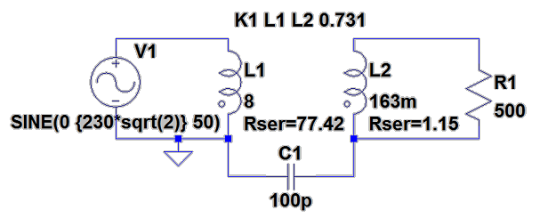

=======================
 Defining Transformers
=======================

----------
Definition
----------

Windings
----------
  - Windings **defined by** two or more **inductors**.
  - To be able to distinguish the magnetic field direction it is recommended to show the **phase dot** of these inductors.
    + right click on the inductor --> select show phase dot

Turns Ratio
-------------
 - defined by the inductance ratio together with the **K coupling**.
   + N_1/N_2 = (1/K) * sqrt(L1) / sqrt(L2)

 - **K coupling** is defined by adding a **Spice Directive**:
   + :code:`K L1 L2 <coupling>` , where <coupling> [0,1]
   + in the event of multiple windings, e.g. :code:`K L1 L2 L3 1`

Floating Nodes
--------------
  - you **can not* have the secondary *floating*, and will need to prove a reference to ground somehow
    + the **interwinding capacitance** fullfills the requirement and so we shall add this capacitor.

--------
Example:
--------
I took a small transformer I had and took some measurements with the LCR meter at 100Hz.

  - Primary Winding: Marked 230 50/60Hz
    + L_s = 8 H
    + DCR = 77.42 Ohm
  - Primary to Secondary
    + C_s = 100 pF
  - Secondary winding: Marked 24V 1A
    + L_s = 163 mH
    + DCR = 1.15 Ohm

So we have a turns ratio of 230 / 24 = 9.583

  - N_1/N_2 = (1/K) * sqrt(L1) / sqrt(L2)
  - K * 9.583 = sqrt(8) / sqrt(0.163)
  - K * 9.583 = 2.82843 / 0.40373
  - K * 9.583 = 7.00575
  - K = 0.731
